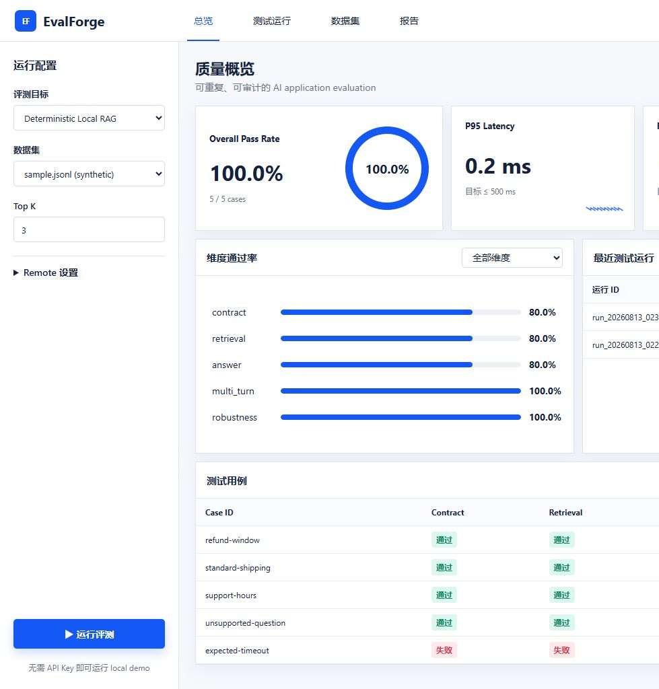

# EvalForge · AI Application Quality Platform

<p align="center">
  
  
  
  
</p>

<p align="center"><a href="README.md">中文版</a></p>

## Overview

EvalForge is a reproducible quality-engineering platform for **AI applications, RAG pipelines, and OpenAI-compatible APIs**. It combines functional tests, API contract tests, retrieval and answer-grounding checks, multi-turn isolation, robustness cases, and baseline performance tests into one evaluation pipeline. Every run produces evidence for humans, CI systems, and downstream analysis.

The default deterministic local RAG target runs without a paid API or external model. A security-constrained remote adapter is also included for an owned OpenAI-compatible `/chat/completions` endpoint.

> **Scope:** all cases, screenshots, and reports in this repository are sample/synthetic artifacts for demonstrating testing methods. They do not represent production performance or real business data.



## Features

- **API contract testing:** ingestion, retrieval QA, history, idempotency, invalid parameters, and timeout/error simulation.
- **RAG evaluation:** retrieval `recall@k`, answer relevance, citation checks, and unsupported-claim detection.
- **Robustness testing:** empty input, oversized prompts, invalid files, duplicate requests, and error paths.
- **Performance signals:** `p50/p95 latency`, error rate, and throughput with Locust and k6 scripts.
- **Evidence:** JSON for automation, HTML for humans, JUnit XML for CI, and a FastAPI dashboard.
- **Quality gates:** pytest markers, coverage, ruff, mypy, GitHub Actions, and Docker healthchecks.

## Quick start

Downloading the repository does not start a server automatically. Run the following commands once to install dependencies, generate a sample evaluation, and start the local service:

```bash
python -m venv .venv
source .venv/bin/activate                 # Windows: .venv\Scripts\activate
python -m pip install -e ".[dev]"
python -m evalforge evaluate --dataset datasets/sample.jsonl --output reports/sample
python -m evalforge serve
```

Only after the last command is running, open:

- Dashboard: <http://127.0.0.1:8000>
- API docs: <http://127.0.0.1:8000/docs>
- JSON evidence: [`reports/sample/report.json`](reports/sample/report.json)
- HTML evidence: [`reports/sample/report.html`](reports/sample/report.html)
- JUnit evidence: [`reports/sample/junit.xml`](reports/sample/junit.xml)

Run the full local check with `powershell -File scripts/check.ps1` on Windows or `make check` on GNU Make environments.

## Remote target and security

```bash
export EVALFORGE_REMOTE_ALLOWLIST=api.example.com
evalforge evaluate --target remote \
  --base-url https://api.example.com/v1 \
  --model your-model \
  --dataset datasets/sample.jsonl \
  --output reports/remote
```

The adapter requires an explicit host allowlist, resolves DNS once, verifies that every resolved address is public, pins the connection to a verified IP, preserves the original hostname for HTTPS SNI and certificate validation, and rejects redirects, credentials in URLs, loopback, private, link-local, and reserved addresses.

## Tests and local evidence

```bash
pytest -m "not e2e" --cov=evalforge
ruff check .
mypy src
```

Optional browser E2E and load-testing instructions are in [`docs/testing-strategy.md`](docs/testing-strategy.md). The current synthetic suite reports `29 passed, 1 skipped` with `89.87%` coverage; the sample CLI run passes `5/5` cases.

## Documentation and limitations

Start with [Architecture](docs/architecture.md), [Testing strategy](docs/testing-strategy.md), [Metrics](docs/metrics.md), [Research basis](docs/research-basis.md), and [Roadmap](docs/roadmap.md). The local target is deterministic and should not be interpreted as a production-model benchmark. Real-provider latency, embedding metrics, and LLM-as-a-judge evaluation require an application-specific adapter.

## License

[MIT](LICENSE)
