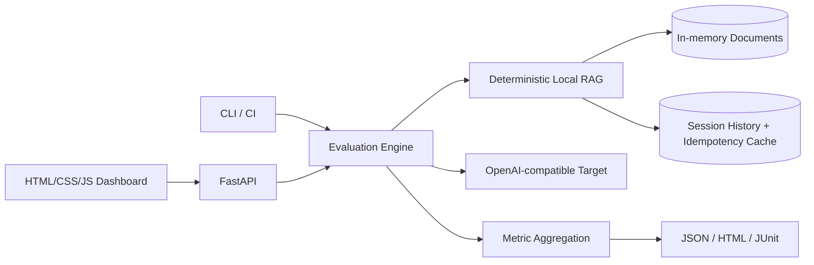

# Architecture

```mermaid
flowchart LR
  CLI[CLI / CI] --> Engine[Evaluation Engine]
  Dashboard[HTML/CSS/JS Dashboard] --> API[FastAPI]
  API --> Engine
  Engine --> Local[Deterministic Local RAG]
  Engine --> Remote[OpenAI-compatible Target]
  Local --> Docs[(In-memory Documents)]
  Local --> Sessions[(Session History + Idempotency Cache)]
  Engine --> Metrics[Metric Aggregation]
  Metrics --> Reports[JSON / HTML / JUnit]
```

Local target 与 evaluator 故意保持在同一进程，确保 demo 可离线、结果可重复。生产化时可替换持久层及 target transport；metric 和 report contract 不必随之变化。`dataset_path` 被限制在 repository root 内，避免 API 被用作任意文件读取入口。
